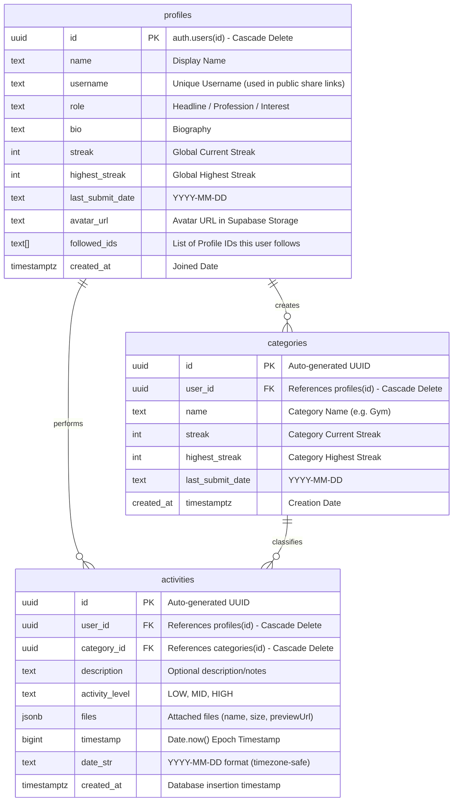

# 🌟 Streakly - Daily Consistency & Activity Tracker

Streakly adalah aplikasi pelacak konsistensi aktivitas harian (*generalized activity tracker*) yang dirancang untuk membantu siapa saja mendokumentasikan kebiasaan mereka (seperti berolahraga, membaca, belajar, dll.) dengan sistem **double-streak** yang kompetitif, grafik kontribusi visual, dan terintegrasi penuh dengan backend **Supabase**.

Aplikasi ini dibangun menggunakan arsitektur modern berbasis **Vite + React + TypeScript + Tailwind CSS** dengan fokus penuh pada pencatatan aktivitas secara visual, bersih dari istilah-istilah teknis atau pemrograman (seperti "repositories", "commits", dll.), sehingga ramah bagi semua kalangan pengguna yang ingin membangun konsistensi hidup.

---

## ✨ Fitur Utama Aplikasi

Streakly dirancang dengan fitur-fitur premium yang mengutamakan visualisasi konsistensi dan kemudahan pencatatan:

### 1. Sistem Double-Streak (Mekanisme Streak Ganda)
Untuk mendorong konsistensi harian secara hibrida, aplikasi melacak dua jenis streak:
* **Streak Global (Akun)**: Melacak konsistensi harian pengguna secara keseluruhan. Pengguna hanya perlu melakukan **aktivitas apa saja di kategori mana saja** setiap hari untuk menjaga streak global ini tetap aktif.
* **Streak Kategori**: Setiap kategori yang dibuat memiliki pelacak streak mandiri. Misalnya, jika pengguna rajin mencatat aktivitas di kategori "Gym" tetapi absen di kategori "Membaca Buku", streak kategori "Gym" akan terus bertambah sementara streak "Membaca Buku" akan kembali ke `0`.

### 2. Grafik Kontribusi Harian (Consistency Grid)
* Grafik berbentuk grid baris-kolom ala kalender tahunan yang memberikan visualisasi kontribusi harian secara instan.
* Setiap sel hari pada grafik menampilkan tingkat intensitas aktivitas berdasarkan beban kerja yang dicatat pada hari tersebut (semakin keras beban kerjanya, semakin kontras warna sel hari tersebut).
* **Modal Detail Kronologis**: Mengeklik sel tanggal pada grafik kontribusi akan menampilkan rincian riwayat aktivitas harian secara terperinci dan kronologis.

### 3. Papan Informasi Statistik Real-Time & Rekomendasi Pintar
Tepat di bawah grafik kontribusi, pengguna disuguhkan dengan 4 kartu statistik utama untuk memantau performa konsistensi mereka:
1. **Streak Tertinggi**: Rekor streak global terlama yang pernah dicapai.
2. **Total Aktivitas**: Jumlah seluruh pencatatan aktivitas yang pernah dibuat.
3. **Hari Aktif Bulan Ini**: Jumlah hari di mana minimal ada satu aktivitas tercatat pada bulan berjalan.
4. **Rasio Konsistensi**: Persentase konsistensi harian berdasarkan jumlah hari aktif dibandingkan total hari.
* **Analisis Produktivitas**: Dilengkapi dengan kartu analisis pintar (*Productivity Analysis*) yang menyajikan statistik kategori teratas, skor konsistensi, serta saran peningkatan produktivitas yang disesuaikan secara otomatis.

### 4. Manajemen Kategori & Pencatatan Aktivitas Instan
* **Kategori Kustom**: Pengguna dapat membuat kategori aktivitas harian sesuka mereka (misalnya: Gym, Coding, Membaca, Ibadah, dll.) dengan sistem pewarnaan yang unik.
* **Pencatatan Cepat**: Memasukkan deskripsi aktivitas, memilih tingkat beban kerja (**EASY**, **MEDIUM**, **HARD**), serta menyertakan lampiran berkas penunjang (seperti bukti foto aktivitas).

### 5. Pengelolaan Media & Pratinjau Gambar Premium
* **Kompresi WebP Otomatis**: Semua foto profil (avatar) dan berkas gambar lampiran yang diunggah dikompresi secara otomatis di sisi klien (*client-side compression*) menjadi format WebP beresolusi tinggi dengan ukuran maksimal 200 KB untuk menghemat bandwidth dan penyimpanan.
* **Modal Dialog Pratinjau**: Mengeklik file gambar lampiran akan langsung membuka modal dialog pratinjau resolusi tinggi.
* **Unduh Berkas Aman**: Terintegrasi dengan sistem pengunduh biner (Blob) yang memungkinkan pengguna mengunduh kembali file lampiran langsung ke perangkat lokal tanpa masalah perizinan lintas situs (*cross-origin*).

### 6. Mode Portofolio Publik (Public Read-Only Mode)
* Pengguna dapat membagikan profil konsistensi mereka ke teman atau publik melalui tautan unik `?u=username` (misalnya: `http://localhost:3000/?u=wiko`).
* **Kunci Pengunjung**: Untuk melindungi privasi dan keamanan data, pengunjung publik dikunci secara otomatis di halaman **Dashboard** saja. Seluruh tombol navigasi pengeditan, pembuatan kategori, pencatatan aktivitas, serta tab-tab sensitif lainnya disembunyikan sepenuhnya dari pandangan publik.

### 7. Sistem Sosial (Following System)
* Pengguna dapat mencari dan mengikuti profil pengguna Streakly lainnya.
* Mempermudah pemantauan konsistensi teman secara timbal balik untuk membangun kebiasaan produktif bersama-sama.

---

## 📁 Struktur Proyek & Komponen Utama

Berikut adalah panduan struktur direktori proyek untuk memudahkan pengembang memahami tata letak modul aplikasi:

```text
Streakly-Web/
├── supabase_schema.sql       # Skema lengkap database PostgreSQL Supabase
├── src/
│   ├── App.tsx               # Entrypoint utama aplikasi, router, state utama, dan inisialisasi awal
│   ├── index.css             # Konfigurasi gaya CSS global dan variabel tema
│   ├── main.tsx              # Mounting aplikasi React ke DOM
│   ├── lib/
│   │   ├── supabase.ts       # Klien Supabase & utilitas unggah/kompresi berkas media
│   │   ├── types.ts          # Kontrak antarmuka TypeScript (Profile, Category, WorkLog, dll.)
│   │   └── utils.ts          # Utilitas kalkulasi tanggal, persentase konsistensi, dan statistik
│   └── components/
│       ├── Navbar.tsx        # Menu navigasi responsif (menyaring hak akses pengunjung publik)
│       ├── Footer.tsx        # Catatan kaki penutup halaman yang estetik
│       ├── Auth.tsx          # Autentikasi komplit (Form login/register & tombol Google OAuth)
│       ├── ProfileCard.tsx   # Tampilan header kartu profil pengguna (nama, bio, pengikut, dll.)
│       ├── ProfileEdit.tsx   # Panel penyuntingan info profil beserta unggahan avatar baru
│       ├── ContributionGraph.tsx # Grafik kontribusi visual (1 tahun) & modal detail hari
│       ├── StreakBadge.tsx   # Indikator visual lencana streak aktif dengan animasi dinamis
│       ├── AnalysisCard.tsx  # Panel simpulan produktivitas & rekomendasi tips kebiasaan
│       ├── LogForm.tsx       # Formulir pembuatan & penyuntingan aktivitas
│       ├── LogList.tsx       # Daftar log aktivitas beserta pratinjau lampiran & download manager
│       ├── FollowingSection.tsx # Daftar pengguna lain & pencarian profil untuk sistem ikuti (social)
│       └── CalendarView.tsx  # Kalender pembantu pencatatan aktivitas harian
```

---

## 🔗 Arsitektur Integrasi Supabase

Streakly mengandalkan infrastruktur **Supabase** secara penuh untuk autentikasi, database PostgreSQL, dan penyimpanan objek.

### 📊 Desain Database (Entity Relationship Diagram)



### 🔐 Kebijakan Keamanan Row Level Security (RLS)
Keamanan database diatur ketat di tingkat baris tabel:
1. **SELECT**: Terbuka secara penuh (`USING (true)`) pada tabel `profiles`, `categories`, dan `activities`. Ini memungkinkan halaman profil publik (`?u=username`) diakses siapa saja tanpa perlu masuk log.
2. **INSERT, UPDATE, DELETE**: Dibatasi secara mutlak hanya untuk pemilik data yang sah yang memiliki token autentikasi aktif (`USING (auth.uid() = user_id)` atau `id`).

### ⚡ Otomatisasi Database Trigger (Pendaftaran Baru)
Ketika ada pengguna baru yang mendaftar (baik lewat verifikasi email standar maupun masuk lewat Google OAuth):
* Supabase Auth akan memicu fungsi basis data Postgres `public.handle_new_user()`.
* Fungsi ini secara otomatis memformat display name, membuang karakter non-alfanumerik untuk **membuat username unik tanpa duplikasi**, mengisi bio default, dan menyisipkan baris awal ke tabel `public.profiles` secara instan.

---

## ⏰ Pemeliharaan Streak: Pendekatan Timezone-Safe Hybrid

Untuk mengatasi selisih zona waktu antara pengguna (lokal) dengan server Supabase (UTC), Streakly menerapkan strategi pemeliharaan streak hibrida:

### 1. Validasi Sisi Klien (Frontend-First)
Karena server database tidak mengetahui kapan zona waktu lokal pengguna memasuki hari baru, sistem validasi dijalankan saat aplikasi dimuat pertama kali di browser pengguna:
* Frontend mengambil tanggal lokal hari ini (`YYYY-MM-DD`).
* Tanggal tersebut dibandingkan dengan `last_submit_date` terakhir pengguna yang tersimpan di database.
* Jika selisih hari lebih dari 1 hari penuh, maka sistem mendeteksi kegagalan konsistensi (broken streak) dan mengirimkan instruksi cepat untuk me-reset nilai `streak` menjadi `0` di database.
* Pendekatan ini menjamin keadilan perhitungan streak sesuai zona waktu lokal pengguna berada!

### 2. Fungsi Basis Data Berkala (Server-side Cron Job)
Bagi akun pengguna pasif yang sudah lama tidak membuka aplikasi web, skema database menyediakan fungsi `public.reset_broken_streaks()` yang bertugas memindai dan me-reset nilai streak profil & kategori yang telah melampaui batas waktu secara periodik di sisi server.

---

## 🛠️ Cara Menjalankan Aplikasi Secara Lokal

### Langkah 1: Kloning & Instal Dependensi
Pastikan repositori sudah diunduh ke komputer lokal Anda, lalu jalankan:
```bash
npm install
```

### Langkah 2: Impor Skema Basis Data Supabase
1. Masuk ke dashboard [Supabase](https://supabase.com) dan buat proyek baru.
2. Salin seluruh isi berkas [supabase_schema.sql](file:///d:/KULIAH/Streakly-Web/supabase_schema.sql) dari root proyek ini.
3. Buka tab **SQL Editor** > **New Query** di dashboard Supabase Anda, tempel kode tersebut, lalu klik **Run** untuk membangun semua tabel, kebijakan keamanan, dan trigger otomatis secara instan.

### Langkah 3: Konfigurasi Storage Buckets
Streakly membutuhkan 2 storage bucket berstatus **Public** di Supabase untuk menampung berkas unggahan:
1. **`avatars`**:
   * Pengaturan: **Public**
   * Tambahkan RLS Storage Policies: Izinkan akses SELECT (baca) ke publik, serta INSERT/UPDATE/DELETE hanya untuk pengguna terautentikasi (`authenticated`).
2. **`attachments`**:
   * Pengaturan: **Public**
   * Tambahkan RLS Storage Policies: Izinkan akses SELECT publik, serta INSERT bagi pengguna terautentikasi.

### Langkah 4: Hubungkan Kunci API (.env)
Buat berkas bernama `.env` pada direktori root proyek Anda dan isikan kredensial URL & Anon Key dari proyek Supabase Anda:
```env
VITE_SUPABASE_URL="https://YOUR_SUPABASE_PROJECT_URL.supabase.co"
VITE_SUPABASE_ANON_KEY="YOUR_SUPABASE_ANON_KEY"
```

### Langkah 5: Aktifkan Login Google OAuth (Opsional)
1. Buat kredensial OAuth Client ID (tipe aplikasi web) di Google Cloud Console.
2. Daftarkan URL callback pengalihan dari Supabase pada Google Cloud Console.
3. Masukkan Google Client ID dan Client Secret ke menu **Authentication** > **Providers** > **Google** di dashboard Supabase Anda.
4. Buka **Authentication** > **URL Configuration**, lalu tambahkan `http://localhost:3000` pada **Redirect URLs**.

### Langkah 6: Jalankan Aplikasi
Jalankan perintah berikut di terminal:
```bash
npm run dev
```
Buka peramban Anda dan kunjungi halaman `http://localhost:3000` untuk mulai menggunakan Streakly! 🚀🔥
