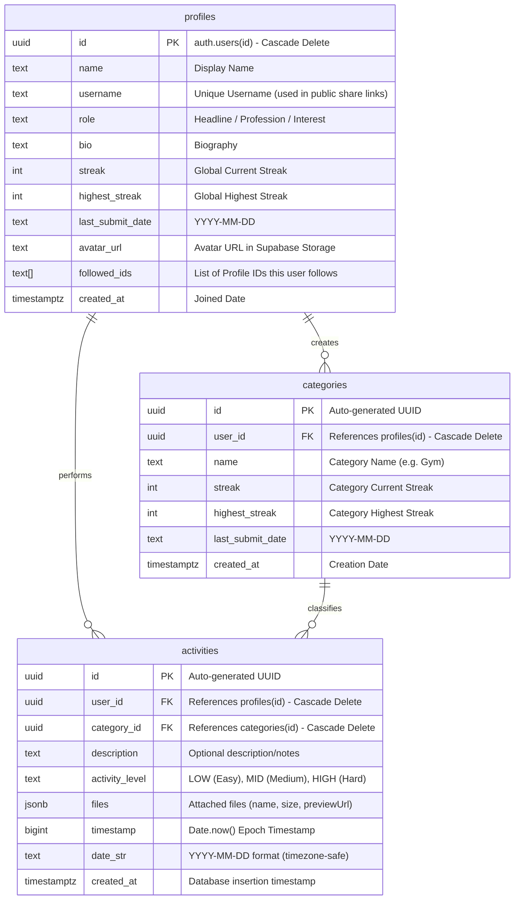

# 🌟 Streakly-Web

Streakly-Web adalah aplikasi pelacak konsistensi aktivitas harian (*generalized activity tracker*) yang dirancang untuk membantu siapa saja mendokumentasikan kebiasaan mereka (seperti berolahraga, membaca, belajar, dll.) dengan sistem **double-streak** yang kompetitif dan terintegrasi dengan backend **Supabase**.

---

## 📌 Alur Utama Aplikasi (*Application Flow*)

Aplikasi ini bersih dari istilah pemrograman/GitHub dan berfokus penuh untuk pencatatan aktivitas umum secara instan:

### 1. Autentikasi Modern (Email & Google OAuth)
* **Pendaftaran Tradisional (Sign Up)**: Menggunakan Email, Password, dan nama pengguna unik (Username).
* **Masuk Tradisional (Login)**: Menggunakan Email dan Password. Kredensial divalidasi langsung oleh Supabase Auth.
* **Masuk Sosial (Google OAuth)**: Pengguna dapat masuk secara instan menggunakan akun Google mereka melalui tombol *"Continue with Google"*.
* **Otomatisasi Akun Baru (Database Trigger)**:
  * Ketika pengguna baru mendaftar lewat Email, atau masuk lewat Google OAuth untuk pertama kalinya, Supabase Auth akan memicu fungsi database Postgres secara otomatis.
  * Fungsi ini akan membuat rekaman profil di tabel `profiles` secara otomatis dengan mengambil nama lengkap, foto profil (avatar), serta **membuat username unik secara otomatis** (diambil dari prefiks email atau nama mereka).
* **Tautan Profil Publik (Monkeytype-Style)**: Setiap pengguna memiliki halaman profil publik unik yang dapat diakses oleh siapa saja secara read-only tanpa perlu login melalui URL: `http://localhost:3000/?u=<username>`. Pengguna dapat menyalin tautan ini dengan sekali klik di menu Profil.

### 2. Kategori (*Category*) & Aktivitas (*Activity*)
Aplikasi bekerja mirip seperti sistem pelacakan keuangan harian yang serba cepat:
* **Category**: Pengguna membuat wadah aktivitas terlebih dahulu (misal: "Gym", "Membaca Buku", "Belajar"). Setiap Kategori melacak streak-nya sendiri.
* **Activity**: Pencatatan aktivitas sangat cepat. Judul aktivitas secara otomatis adalah nama Kategori yang dipilih. 
  * *Input*: Pilihan Kategori (Wajib), Deskripsi (Opsional/Boleh Kosong), Beban Kerja (EASY, MEDIUM, HARD), dan Lampiran File (Opsional).

### 3. Sistem Streak Ganda (*Double Streak Mechanics*)
Aplikasi ini melacak dua jenis konsistensi harian secara hibrida:
* **Streak Per Kategori**: Setiap Kategori mempertahankan streak tersendiri. Streak bertambah jika aktivitas dicatat di kategori tersebut hari ini. Jika kategori tidak diisi selama lebih dari 1 hari, streak kategori tersebut kembali ke `0`.
* **Streak Global Akun**: Akun pengguna sendiri memiliki streak harian global. Syarat mempertahankan streak global adalah mengisi **aktivitas apa saja di kategori mana saja** setiap hari. Jika dalam satu hari penuh tidak ada aktivitas sama sekali yang dicatat, streak global akun kembali ke `0`.

---

## 📊 Entity Relationship Diagram (ERD)

Desain basis data dirancang secara efisien untuk mendukung relasi antar-entitas secara dinamis:



---

## ⏰ Pemeliharaan Streak: Pendekatan Timezone-Safe Hybrid

Untuk menjaga keadilan perhitungan streak (kembali ke `0` jika dalam sehari tidak ada input), aplikasi menggunakan kombinasi terbaik berikut:

### 1. Metode Sinkronisasi Client (Penentu Utama)
Karena server database bekerja di zona waktu UTC dan pengguna berada di zona waktu lokal (misal: WIB/GMT+7), *cron job* murni di DB dapat me-reset streak secara tidak adil di jam aktif pengguna.
* **Solusi**: Saat aplikasi dimuat pertama kali di browser, sistem frontend akan memverifikasi tanggal lokal pengguna. Jika tanggal hari ini di browser berselisih lebih dari 1 hari dengan `last_submit_date` (baik global maupun kategori), frontend akan mengirimkan perintah cepat ke Supabase untuk memperbarui status streak menjadi `0` secara instan. Ini menjamin akurasi streak sesuai zona waktu lokal pengguna!

### 2. Metode Database Cron Job (Pembersih Berkala)
Sebagai pembersih data berkala untuk akun-akun pasif yang sudah lama tidak membuka web, kita tetap menyediakan cron job di database untuk me-reset data streak yang sudah melampaui batas waktu:
```sql
CREATE OR REPLACE FUNCTION reset_broken_streaks()
RETURNS void AS $$
DECLARE
  today_str TEXT := to_char(current_date, 'YYYY-MM-DD');
  yesterday_str TEXT := to_char(current_date - 1, 'YYYY-MM-DD');
BEGIN
  -- Reset streak global akun yang putus
  UPDATE public.profiles
  SET streak = 0
  WHERE last_submit_date IS NULL 
     OR (last_submit_date != today_str AND last_submit_date != yesterday_str);

  -- Reset streak kategori yang putus
  UPDATE public.categories
  SET streak = 0
  WHERE last_submit_date IS NULL 
     OR (last_submit_date != today_str AND last_submit_date != yesterday_str);
END;
$$ LANGUAGE plpgsql;
```

---

## 📦 Kebutuhan Supabase Storage Buckets
Untuk menangani unggahan media secara efisien, Anda perlu membuat dua buah **Storage Bucket** di dashboard Supabase Anda:

1. **`avatars`**:
   * Pengaturan: **Public** (agar foto profil dapat diakses oleh semua orang di halaman profil publik).
   * Kebijakan RLS (Storage Policies): Izinkan pengguna terautentikasi (*authenticated*) mengunggah (*INSERT*), memperbarui (*UPDATE*), dan menghapus (*DELETE*) file di dalam bucket ini dengan nama file yang sesuai dengan ID mereka.
2. **`attachments`**:
   * Pengaturan: **Public**.
   * Kebijakan RLS (Storage Policies): Izinkan pengguna terautentikasi mengunggah file lampiran aktivitas mereka sendiri.

---

## 🛠️ Cara Aktivasi Google OAuth di Supabase
1. Masuk ke **Google Cloud Console**, buat proyek baru, dan buat kredensial **OAuth Client ID** (Web Application).
2. Tambahkan Authorized Redirect URIs dari Google dengan URI redirect milik Supabase Anda (bisa didapatkan di Supabase console: **Authentication > Providers > Google**).
3. Masuk ke dashboard **Supabase**, buka menu **Authentication > Providers > Google**:
   * Aktifkan Google Provider.
   * Masukkan **Client ID** dan **Client Secret** yang Anda dapatkan dari Google Cloud Console.
4. Di dashboard Supabase, buka **Authentication > URL Configuration**:
   * Tambahkan `http://localhost:3000` (atau domain produksi Anda) ke dalam **Redirect URLs** agar Supabase tahu ke mana harus mengarahkan kembali setelah login Google berhasil.

---

## 🚀 Cara Menjalankan Aplikasi Secara Lokal
1. Pastikan Anda sudah menginstal package dengan menjalankan:
   ```bash
   npm install
   ```
2. Buat file `.env` di direktori utama proyek dan masukkan kredensial Supabase Anda:
   ```env
   VITE_SUPABASE_URL="https://YOUR_SUPABASE_PROJECT_URL.supabase.co"
   VITE_SUPABASE_ANON_KEY="YOUR_SUPABASE_ANON_KEY"
   ```
3. Jalankan server pengembangan lokal:
   ```bash
   npm run dev
   ```
